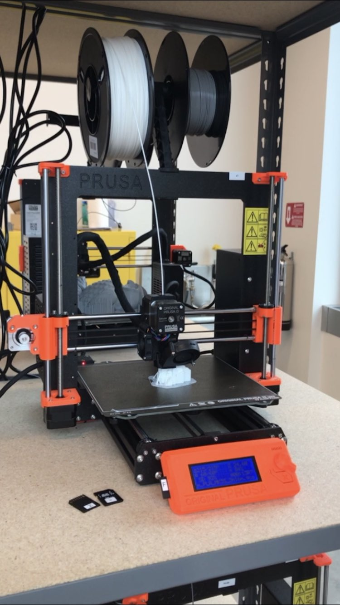
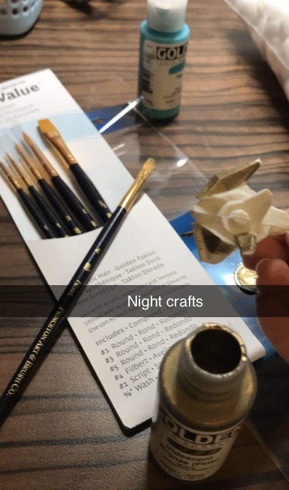
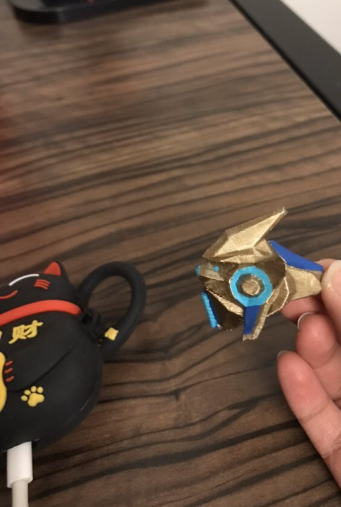

## The Perfect Combo

I've been following the game StarCraft2 since 2016 and although I haven't played consistently, I've always made time to watch StarCraft Esports--tournaments like WCS, ESL, Cheesadelphia, and my favorite: HomeStory Cup. When I do play, I play protoss so when I saw a probe on <a target="_blank" href="https://www.thingiverse.com/thing:750390">Thingiverse</a> I added this project to the top of my list. This was my first project 3D printing and it was neat to learn how it worked.

## Learnings

The new library at my university opened recently and it houses the Makerspace. All the equipment was provided and the staff walked me through some training on how to use the 3D printers. They were so friendly, I really appreciate them. So I downloaded the probe STL file, used the slicer to set parameters like its size and saved the G-code to an SD card. Placed it in an unoccupied printer and watched the magic happen. 

Used some pliers to get rid of the support pieces, then headed to Blick for painting supplies. After spending time studying for my classes, it was relaxing to end the night with painting.

## Probius in Action

And here's the finished product! I will admit certain areas are a bit bumpy, so the next thing I want to learn how to do properly is sanding my prints.

I made another one for my friend. I'm trying to make a probe army, but of course I need to keep an eye out on my supply.
