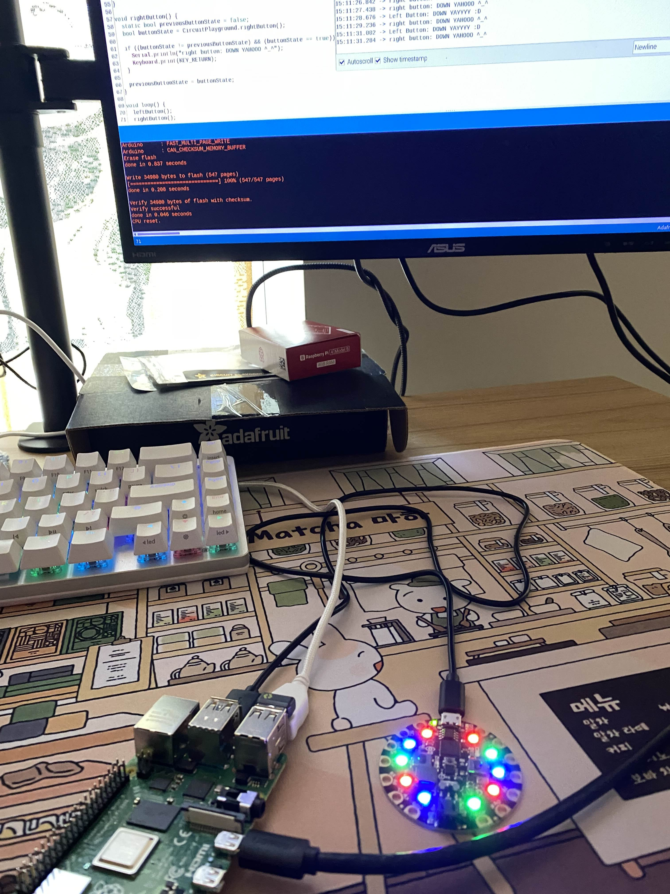
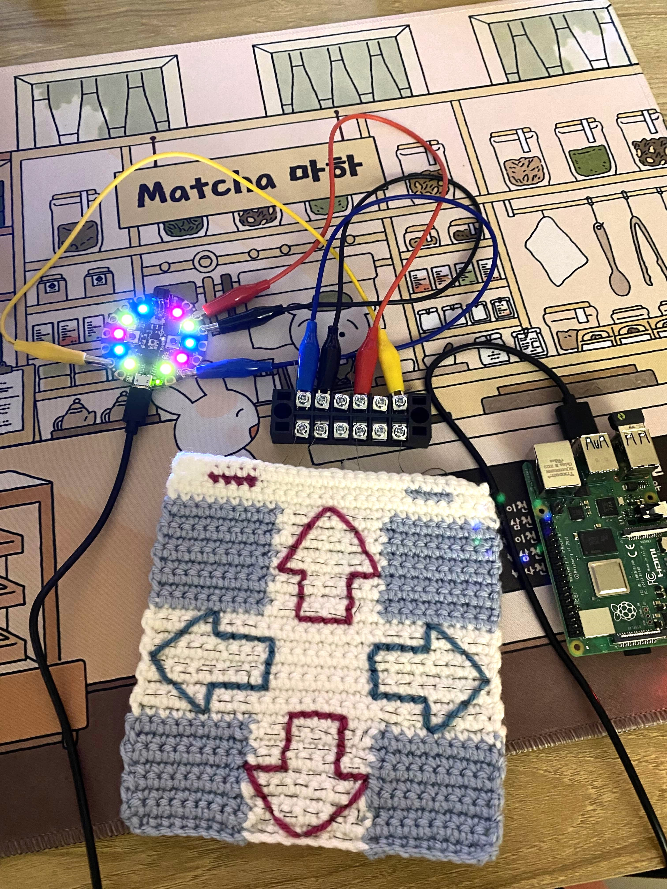

## An Iconic Rhythm Game

Before I started playing rhythm games like Sound Voltex and osu, I played Dance Dance Revolution. This project was nostalgic and satisfied my curiosity to learn how to make something with a Raspberry Pi. I've been meaning to mess around with a Raspberry Pi for a while and was excited to see this <a target="_blank" href="https://www.popsci.com/story/diy/build-arcade-dance-game/">tutorial</a>.

## Learnings

This was a fun project for me to combine the things I enjoy: crochet and technology. I used the Circuit Playground Express instead of the classic listed in the tutorial, crocheted the dance mat, and had to troubleshoot the code in the dance controller software since the capacitive touch wasn’t working initially for me. I used Premier's Anti-Pilling Everyday Worsted yarn and I made the pattern using <a href="https://www.stitchfiddle.com/en" target="_blank">Stitch Fiddle</a>.

Looking back, I should have considered the placement of the conductive thread from the dance mat to the terminal block more thoroughly because the up and down arrows were interfering with each other (taped the excess threads away from each other which worked but not the most elegant solution lol). This time, I wanted to get that MVP going and I was excited to start gaming with it.

## Demo

Here's a quick demo! Maybe I'll crochet a controller for the rhythm game Taiko no Tatsujin next..
<video src="/ddrvid.mp4" width="320" height="240" controls></video>